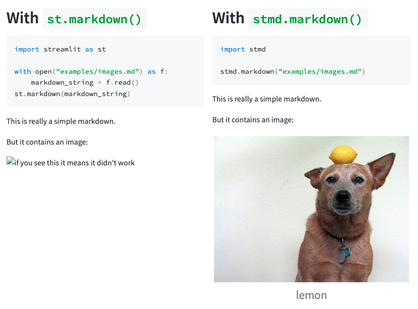

# Streamlit Markdown

Print markdown files in Streamlit without thinking about it!



## Usage

1. Install from PyPi (not yet available)
  ```bash
  pip install stmd
  ```

2. Import and use it in your Streamlit app
  ```python
  import stmd

  stmd.markdown("examples/images.md")
  ```

## Contribute

[How to install the project and contribute](CONTRIBUTING.md)
